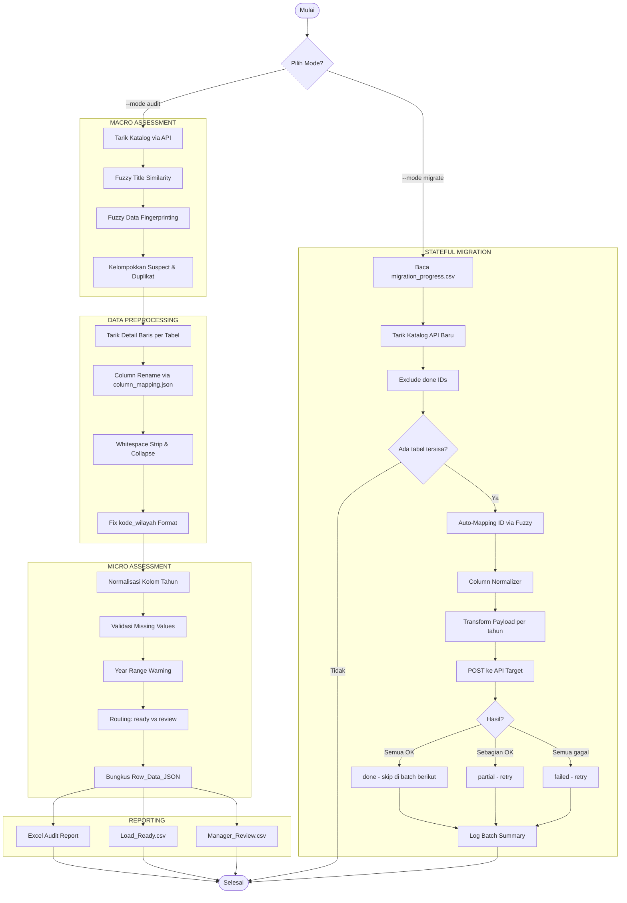

# Sistem ETL & Migrasi Data Otomatis — Satu Data Jateng

Pipeline ETL (Extract, Transform, Load) untuk mengaudit, membersihkan, dan memigrasikan data tabular dari repositori data lama (Sistem Legacy) ke Portal Satu Data Jateng yang baru.

Dibangun dengan fokus pada **Ketahanan Jaringan (Resilience)**, **Validasi Forensik (Human-in-the-Loop)**, **Normalisasi Data Otomatis**, dan **Migrasi Stateful** — mampu dilanjutkan antar batch tanpa risiko data dobel.

---

## Fitur Utama

| Fitur | Deskripsi |
|---|---|
| **Dual-Mode Execution** | `--mode audit` untuk pra-evaluasi data, `--mode migrate` untuk pengiriman ke API target |
| **Data Preprocessing** | Normalisasi kolom otomatis, perbaikan format `kode_wilayah`, pembersihan multi-space |
| **Column Mapping** | Pemetaan nama kolom non-standar ke standar via `column_mapping.json` |
| **Fuzzy Table Deduplication** | Deteksi dataset duplikat via kemiripan judul + fingerprint data baris (bidirectional fuzzy) |
| **Year Validation** | Warning otomatis untuk tahun di luar range (default 2000-2025), tanpa memblokir data |
| **Hybrid Reporting** | Laporan eksekutif Excel + data mentah CSV, terpisah antara *ready* dan *review* |
| **Smart Auto-Mapping** | Mencocokkan ID dataset lama ke sistem baru via kemiripan judul (fuzzy NLP) |
| **Stateful Batch Migration** | Pipeline migrate bisa dilanjutkan antar batch — tabel `done` otomatis di-skip |
| **Column Normalizer (Loader)** | Rename kolom payload sebelum POST ke API target, mencegah 422 error |

---

## Alur Sistem

Sistem beroperasi dalam dua jalur utama yang terpisah untuk menjaga keamanan data.



---

## Struktur Proyek

```text
ETL_Pipeline_Satu-Data-Jateng/
├── data/
│   ├── column_mapping.json          # Konfigurasi alias nama kolom
│   ├── raw/                         # Penyimpanan sementara (opsional)
│   ├── processed/                   # Data hasil pemrosesan
│   └── reports/                     # Semua output laporan:
│       ├── Audit_Migrasi_*.xlsx         # Laporan Eksekutif (5 sheet)
│       ├── Load_Ready_*.csv             # Data siap migrasi
│       ├── Manager_Review_*.csv         # Data perlu review manual
│       ├── auto_mapping_result.csv      # Hasil Auto-Mapping ID
│       ├── unmapped_datasets.csv        # Dataset tanpa kecocokan
│       ├── column_mapping_report.csv    # Log rename kolom saat migrasi
│       ├── failed_payloads_batch*.csv   # Payload gagal per batch
│       └── migration_progress.csv       # State migrasi (stateful)
│
├── src/
│   ├── config.py                    # Pembacaan .env & pengaturan
│   ├── extract.py                   # API client sistem lama (retry, paginated)
│   ├── catalog_assessor.py          # Macro-Assessment (duplikat fuzzy)
│   ├── data_preprocessor.py         # Preprocessing: rename, whitespace, kode_wilayah
│   ├── data_assessor.py             # Micro-Assessment: validasi & warning
│   ├── load.py                      # LoadGate — filter rows by migration_status
│   ├── reporting.py                 # Report generator (Excel & CSV)
│   ├── pipeline.py                  # Orkestrator mode audit
│   └── loader/                      # Modul mode migrate
│       ├── client.py                    # HTTP client API target
│       ├── mapper.py                    # Auto-Mapping ID (fuzzy title)
│       ├── column_normalizer.py         # Normalisasi kolom sebelum POST
│       ├── transform.py                 # Transform payload & grouping per tahun
│       ├── progress_tracker.py          # State tracker antar batch
│       └── pipeline.py                  # Orkestrator mode migrate
│
├── tests/                           # 143 unit & system tests
│   ├── conftest.py                      # Shared fixtures
│   ├── test_catalog_assessor.py         # Fuzzy grouping & fingerprint
│   ├── test_data_preprocessor.py        # Column rename, whitespace, kode_wilayah
│   ├── test_data_assess.py              # Flag, warn, standardize year
│   ├── test_column_normalizer.py        # Loader column normalizer
│   ├── test_extract.py                  # Paginated extraction
│   ├── test_load.py                     # LoadGate filtering
│   ├── test_loader_client.py            # Target API client
│   ├── test_mapper.py                   # Auto-Mapping & collision
│   ├── test_progress_tracker.py         # State persistence & upsert
│   ├── test_transform.py               # Payload transformation
│   ├── test_system_audit.py             # E2E audit pipeline
│   └── test_system_migrate.py           # E2E migrate pipeline
│
├── logs/
│   └── etl-pipeline.log            # Log eksekusi
├── .env                             # Environment variables (tidak di-commit)
├── .env.example                     # Template .env
├── requirements.txt
└── main.py                          # Entry point (CLI)
```

---

## Instalasi

### Prasyarat

- Python 3.10+
- `pip`

### Setup

```bash
# 1. Clone & masuk ke folder proyek
git clone <repo_url>
cd ETL_Pipeline_Satu-Data-Jateng

# 2. Buat virtual environment
python -m venv .venv

# Windows:
.venv\Scripts\activate
# Mac/Linux:
source .venv/bin/activate

# 3. Install dependensi
pip install -r requirements.txt

# 4. Salin dan isi .env
cp .env.example .env
# Edit .env dengan kredensial yang benar
```

### Konfigurasi `.env`

```env
# ── SISTEM LAMA (SOURCE) ─────────────────────────────────
BASE_URL=https://[URL_SISTEM_LAMA]/v1/data
API_KEY=Bearer TOKEN_LAMA_ANDA
MAX_PAGES=11                        # Maks halaman katalog yang diambil
MAX_DATASETS_TO_ASSESS=1000         # Maks dataset yang dievaluasi

# ── PENGATURAN AUDIT ──────────────────────────────────────
DUPLICATE_TITLE_THRESHOLD=85        # 0-100, threshold kemiripan judul
DUPLICATE_SAMPLE_SIZE=5             # Jumlah baris sampel untuk cek duplikat
REQUIRED_COLUMNS=tahun,kode_wilayah # Kolom wajib per tabel
LOAD_ALLOWED_STATUSES=ready         # Status yang boleh dimuat
YEAR_MIN=2000                       # Batas bawah tahun (warning jika < ini)
YEAR_MAX=2025                       # Batas atas tahun (warning jika > ini)

# ── SISTEM BARU (TARGET) ─────────────────────────────────
NEW_BASE_URL=https://[URL_SISTEM_BARU]/api/v1/data
NEW_API_KEY=Bearer TOKEN_BARU_ANDA
```

---

## Cara Penggunaan

### Tahap 1 — Mode Audit

Mode ini **tidak mengirim data** ke sistem baru. Ia menarik data dari sistem lama, membersihkan, mengevaluasi kualitasnya, dan menghasilkan laporan.

```bash
python main.py --mode audit
```

**Yang terjadi:**

1. Tarik seluruh katalog dataset dari API sistem lama (paginated)
2. **Macro Assessment** — Deteksi dataset duplikat via fuzzy title + fingerprint data
3. **Preprocessing** — Per dataset:
   - Rename kolom non-standar via `column_mapping.json`
   - Strip & collapse whitespace (`"Jawa   Tengah"` → `"Jawa Tengah"`)
   - Fix format `kode_wilayah` (`3320` → `33.20`)
4. **Micro Assessment** — Per dataset:
   - Normalisasi kolom tahun (fallback safety)
   - Flag baris dengan missing values pada kolom wajib
   - Warning untuk tahun di luar range (tetap pass, tidak diblokir)
5. **Routing** — Pisahkan data ke *ready* atau *review*
6. **Reporting** — Generate Excel + CSV

**Output di `data/reports/`:**

| File | Isi |
|---|---|
| `Audit_Migrasi_*.xlsx` | Laporan eksekutif multi-sheet |
| `Load_Ready_*.csv` | Data 100% bersih, siap migrate |
| `Manager_Review_*.csv` | Data perlu review manual |

---

### Tahap 2 — Mode Migrate

Setelah file CSV dari Tahap 1 tersedia, jalankan mode ini untuk mengirim data ke sistem baru. Pipeline ini **stateful** — progress disimpan di `migration_progress.csv`.

```bash
python main.py --mode migrate --ready_file data/reports/Load_Ready_XXXXXXXX_XXXX.csv
```

> Jika `--ready_file` tidak diisi, default: `data/load_ready.csv`.

**Yang terjadi:**

1. Baca progress dari `migration_progress.csv` (kosong jika cold start)
2. Tarik katalog dari API sistem baru
3. Exclude tabel yang sudah `done` dari batch sebelumnya
4. Auto-Mapping judul lama → ID sistem baru (fuzzy)
5. Normalisasi kolom payload via `ColumnNormalizer` + `column_mapping.json`
6. Transform & POST payload per `tahun_data` ke API target
7. Catat status per dataset: `done` / `partial` / `failed`
8. Simpan rename report ke `column_mapping_report.csv`

**Status Migrasi per Tabel:**

| Status | Arti | Batch Berikutnya |
|---|---|---|
| `done` | Semua tahun berhasil | **Di-skip** |
| `partial` | Sebagian tahun gagal | Di-retry |
| `failed` | Semua tahun gagal | Di-retry |

**Contoh log output:**

```
------------------------------------------------------------
STATUS KATALOG TARGET | Total: 5 tabel | Done: 3 | Sisa: 2
------------------------------------------------------------
  [DONE]    ID=    1 | Data Padi Jawa Tengah
  [DONE]    ID=    2 | Data Jagung Per Kabupaten
  [DONE]    ID=    3 | Data Kedelai
  [PARTIAL] ID=    4 | Data Kemiskinan Jateng
  [NEW]     ID=    5 | Data Curah Hujan
------------------------------------------------------------
=== BATCH #2 SELESAI | Done: 1 | Partial: 0 | Gagal: 1 ===
PROGRESS TOTAL: 4/5 tabel selesai | 1 tabel tersisa
```

---

## Detail Teknis

### Data Preprocessing (`DataPreprocessor`)

Tahap cleaning yang berjalan **sebelum** assessment. Tiga operasi dijalankan secara berurutan:

#### 1. Column Normalization

Rename kolom non-standar ke nama standar berdasarkan `data/column_mapping.json`:

```json
{
  "column_aliases": {
    "kab_kota": "nama_wilayah",
    "kod_wil": "kode_wilayah",
    "thn": "tahun",
    "jml": "jumlah"
  },
  "fuzzy_threshold": 80
}
```

**Prioritas matching:**
1. **Explicit alias** — Lookup langsung dari JSON (pasti benar)
2. **Hardcoded tahun** — Patterns `tahun_data`, `thn`, `year` (fallback safety)
3. **Lowercase** — `Kecamatan` → `kecamatan`

> Jika 2+ kolom rename ke target yang sama (misal `tahun_data` DAN `tahun_pembuatan` → `tahun`), hanya yang pertama yang di-rename. Yang kedua di-skip dengan warning untuk mencegah duplikat kolom.

#### 2. Whitespace Normalization

- Strip leading/trailing whitespace
- Collapse multiple spaces: `"Jawa   Tengah"` → `"Jawa Tengah"`
- NaN tetap NaN (tidak berubah jadi string `"nan"`)

#### 3. Kode Wilayah Format Fix

Memperbaiki format kode wilayah sesuai standar BPS (Badan Pusat Statistik):

| Input | Digit | Output | Level |
|---|---|---|---|
| `3320` | 4 | `33.20` | Kab/Kota |
| `332001` | 6 | `33.20.01` | Kecamatan |
| `33200107` | 8 | `33.20.01.07` | Kelurahan |
| `3320010007` | 10 | `33.20.01.0007` | Desa |
| `33.20` | — | `33.20` (skip) | Sudah benar |
| `abc` | — | `abc` (skip + warn) | Non-numeric |

---

### Year Validation (`warn_suspicious_year`)

Menandai baris dengan tahun **di luar range** (default `[2000-2025]`) sebagai **WARNING**:

| Aspek | `flag_*()` (blocking) | `warn_suspicious_year()` (non-blocking) |
|---|---|---|
| `migration_status` | → `flagged` (diblokir) | Tidak berubah (tetap `ready`) |
| `flag_reason` | Ditambah alasan | Ditambah `WARNING: ...` |
| Efek pada load | Baris **tidak di-load** | Baris **tetap di-load** |
| Use case | Data rusak: missing, NaN | Data mencurigakan tapi mungkin valid |

Konfigurasi via `.env`:
```env
YEAR_MIN=2000
YEAR_MAX=2025
```

---

### Column Normalizer (Loader)

Saat mode `migrate`, kolom payload di-normalize **sebelum POST** ke API target menggunakan `ColumnNormalizer`:

**Strategi matching (berurutan):**
1. **Explicit alias** — Dari `column_mapping.json`
2. **Already standard** — Kolom sudah jadi target name → skip
3. **Exact match** — Terhadap known target columns
4. **Fuzzy match** — Threshold 80% (configurable)
5. **Lowercase fallback** — Normalisasi minimal

Setelah migrasi, cek `data/reports/column_mapping_report.csv` untuk melihat semua rename yang dilakukan.

---

### Logika Deteksi Duplikat

Deteksi duplikat berjalan dalam dua tahap:

#### Tahap 1 — Kemiripan Judul (Macro)

Menggunakan `fuzz.token_sort_ratio` untuk mengelompokkan dataset yang judulnya mirip:

```
"Data Padi Jawa Tengah"  vs  "Jawa Tengah Data Padi"
→ token_sort_ratio = 100  → suspect group
```

#### Tahap 2 — Kemiripan Data (Micro)

Untuk setiap pasangan suspect, diambil N baris sampel. Fingerprint per baris dalam format `col=val|col=val`, lalu dibandingkan dengan **bidirectional fuzzy matching**:

| Skenario | Exact Match (MD5) | Fuzzy Match (>=98%) |
|---|---|---|
| Data identik persis | Terdeteksi | Terdeteksi |
| Data identik, urutan beda | Terdeteksi | Terdeteksi |
| Data hampir identik (1 typo) | **Tidak** terdeteksi | Terdeteksi |
| Data berbeda | Tidak terdeteksi | Tidak terdeteksi |

---

### Routing Data (Audit)

Setelah micro-assessment, setiap dataset mendapat keputusan:

| Kondisi | Keputusan | Routing |
|---|---|---|
| Tidak suspect & tidak ada baris flagged | `ready_for_load` | Baris ready → `Load_Ready.csv` |
| Suspect **ATAU** ada baris flagged | `manager_review_required` | **SEMUA baris** → `Manager_Review.csv` |

> **Mengapa semua baris dikirim ke review?** Dataset suspect memiliki keraguan pada identitas datanya. Membiarkan baris "ready" dari dataset suspect langsung dimuat dapat mencemari sistem target jika ternyata dataset tersebut duplikat.

---

## Menambah Alias Kolom Baru

Edit `data/column_mapping.json`:

```json
{
  "column_aliases": {
    "nama_kolom_lama": "nama_kolom_standar",
    "singkatan": "nama_lengkap"
  },
  "fuzzy_threshold": 80
}
```

File ini digunakan oleh **dua** komponen:
- `DataPreprocessor` (audit) — Rename kolom DataFrame sebelum assessment
- `ColumnNormalizer` (migrate) — Rename kolom record dict sebelum POST ke API

---

## Pengujian

Proyek ini diuji menggunakan **Pytest** dengan 143 test cases:

```bash
# Jalankan semua test
pytest tests/ -v

# Dengan coverage report
pytest tests/ --cov=src

# Jalankan test tertentu
pytest tests/test_data_preprocessor.py -v
```

### Test Coverage per Modul

| File Test | Modul yang Diuji | Jumlah Test |
|---|---|---|
| `test_data_preprocessor.py` | Column rename, whitespace strip, kode_wilayah fix | 25 |
| `test_column_normalizer.py` | Loader column normalizer (alias, fuzzy, cache) | 18 |
| `test_transform.py` | Payload transformation & grouping per tahun | 16 |
| `test_progress_tracker.py` | State persistence, upsert, batch increment | 16 |
| `test_system_audit.py` | E2E audit pipeline (mock API) | 11 |
| `test_system_migrate.py` | E2E migrate pipeline (mock API) | 12 |
| `test_mapper.py` | Auto-Mapping ID & collision detection | 10 |
| `test_loader_client.py` | HTTP client API target | 10 |
| `test_data_assess.py` | Flag, warn, standardize year | 8 |
| `test_catalog_assessor.py` | Fuzzy grouping & fingerprint | 7 |
| `test_load.py` | LoadGate status filtering | 5 |
| `test_extract.py` | Paginated extraction | 5 |

---

## Riwayat Perbaikan

### Bug Kritis (Diperbaiki)

| # | File | Masalah | Perbaikan |
|---|---|---|---|
| 1 | `config.py` | `os.getenv("NEW_BASE_URL").rstrip("/")` crash jika env var kosong | `(os.getenv(...) or "").rstrip("/")` |
| 2 | `loader/client.py` | `cloase()` typo → `AttributeError` | Rename ke `close()` |
| 3 | `loader/client.py` | `response` belum diinisialisasi → `UnboundLocalError` | `response = None` sebelum `try` |
| 4 | `loader/pipeline.py` | `MigrationTranformer` typo → `NameError` | Selaraskan penamaan |
| 5 | `progress_tracker.py` | `loc[mask, k] = v` crash dengan `ValueError: duplicate labels` | Drop-then-append pattern |
| 6 | `mapper.py` | Path `data/report/` tanpa 's' → `FileNotFoundError` | `data/reports/` + `os.makedirs` |

### Bug Logika (Diperbaiki)

| # | File | Masalah | Perbaikan |
|---|---|---|---|
| 7 | `catalog_assessor.py` | MD5 fingerprint → false negative pada data hampir identik | Fuzzy bidirectional row comparison |
| 8 | `catalog_assessor.py` | `sorted(all_values)` ubah konteks kolom → false positive | Format `col=val\|col=val` per baris |
| 9 | `pipeline.py` | Baris ready dari dataset suspect hilang | Routing semua baris suspect ke review |
| 10 | `transform.py` | `row.pop("tahun")` mutasi dict asli (side effect) | `row.get("tahun")` + dict comprehension |
| 11 | `data_preprocessor.py` | Multiple kolom rename ke target sama → duplicate columns | Track `used_targets`, skip duplikat |
| 12 | `data_preprocessor.py` | Unicode arrow `->` crash di Windows cp1252 console | ASCII `->` di log message |

### Peningkatan (Ditambahkan)

| # | Komponen | Peningkatan |
|---|---|---|
| 13 | `data_preprocessor.py` | **Baru:** Preprocessing pipeline (rename, whitespace, kode_wilayah) |
| 14 | `data_assessor.py` | **Baru:** `warn_suspicious_year()` — warning tanpa blocking |
| 15 | `column_normalizer.py` | **Baru:** Normalisasi kolom sebelum POST ke API target |
| 16 | `progress_tracker.py` | **Baru:** State migrasi persisten antar batch |
| 17 | `loader/pipeline.py` | Stateful: skip `done`, track `partial`/`failed` |
| 18 | `mapper.py` | Deteksi collision mapping (1 `new_id` → banyak `old_id`) |
| 19 | `config.py` | `YEAR_MIN`, `YEAR_MAX` configurable dari `.env` |
| 20 | `column_mapping.json` | **Baru:** Konfigurasi alias kolom terpusat |

---

## Dependensi

```text
pandas==2.2.1         # Manipulasi data tabular
requests==2.31.0      # HTTP client dengan retry support
python-dotenv==1.0.1  # Pembacaan .env
openpyxl==3.1.2       # Generate laporan Excel
thefuzz               # Fuzzy string matching
pytest==8.1.1         # Test framework
pytest-cov            # Coverage reporting
```

---

## Dokumentasi Lengkap

Dokumentasi detail tersedia di folder [`docs/`](docs/INDEX.md):

| Dokumen | Deskripsi |
|---|---|
| [ARCHITECTURE.md](docs/ARCHITECTURE.md) | Arsitektur sistem, alur data, dependency graph |
| [DEVELOPER_GUIDE.md](docs/DEVELOPER_GUIDE.md) | Setup, konvensi kode, cara menambah fitur |
| [API_REFERENCE.md](docs/API_REFERENCE.md) | Referensi kelas dan method per modul |
| [CHANGELOG.md](docs/CHANGELOG.md) | Riwayat perubahan per versi |
| [TROUBLESHOOTING.md](docs/TROUBLESHOOTING.md) | Panduan mengatasi error umum |
| [DEPLOYMENT.md](docs/DEPLOYMENT.md) | Panduan operasional production |

---

## Lisensi

Proyek internal Satu Data Jawa Tengah by the intern.