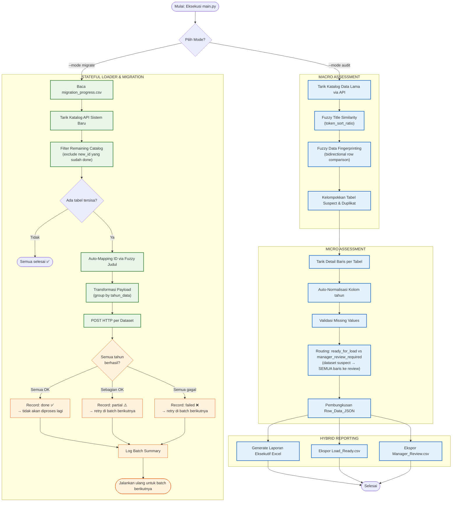

# 🚀 Sistem ETL & Migrasi Data Otomatis (Satu Data Jateng)

Proyek ini adalah *pipeline* ETL (Extract, Transform, Load) bertaraf *enterprise* yang dirancang untuk mengaudit, membersihkan, dan memigrasikan data tabular dari repositori data lama (Sistem Legacy) ke Portal Data Rebranding yang baru.

Sistem ini dibangun dengan fokus pada **Ketahanan Jaringan (Resilience)**, **Validasi Forensik (Human-in-the-Loop)**, dan **Migrasi Stateful yang Aman** — mampu dilanjutkan antar batch tanpa risiko data dobel.

---

## ✨ Fitur Utama

1. **Dual-Mode Execution:** Mode `--mode audit` untuk pra-evaluasi data, dan `--mode migrate` untuk pengeksekusian API target.
2. **Auto-Schema Normalization:** Secara cerdas mendeteksi dan menstandarisasi kolom "tahun" meskipun nama tidak konsisten (`tahun_data`, `thn`, `Tahun`, dll.).
3. **Fuzzy Table Deduplication:** Mencegah migrasi data duplikat menggunakan `token_sort_ratio` untuk kesamaan judul, dikombinasikan dengan **fuzzy comparison antar baris** untuk mendeteksi dataset yang hampir identik (lebih dari 90% mirip), bukan sekadar exact-match.
4. **Hybrid Reporting:** Otomatis memisahkan laporan eksekutif ke Excel (`.xlsx`) dan data mentah ke CSV massal untuk menghindari batas limit baris Excel.
5. **Smart Auto-Mapping:** Mencocokkan ID Dataset dari sistem lama ke sistem baru secara otomatis menggunakan kemiripan judul (fuzzy NLP).
6. **Stateful Batch Migration:** Pipeline migrate dapat dilanjutkan antar batch — tabel yang sudah berhasil di-POST tidak akan dikirim ulang, mencegah data dobel.

---

## 🔄 Alur Sistem (Flowchart)

Sistem beroperasi dalam dua jalur utama yang terpisah untuk menjaga keamanan data.



---

## 📂 Struktur Proyek

```text
ETL_Pipeline_Satu-Data-Jateng/
├── data/
│   ├── raw/                    # Tempat penyimpanan sementara (opsional)
│   ├── processed/              # Data hasil pemrosesan
│   └── reports/                # Output seluruh laporan:
│       ├── Audit_Migrasi_*.xlsx        # Laporan Eksekutif (4 sheet)
│       ├── Load_Ready_*.csv            # Data siap migrasi
│       ├── Manager_Review_*.csv        # Data perlu review manual
│       ├── auto_mapping_result.csv     # Hasil Auto-Mapping ID
│       ├── unmapped_datasets.csv       # Dataset tanpa kecocokan di sistem baru
│       ├── failed_payloads_batch*.csv  # Payload yang gagal di-POST per batch
│       └── migration_progress.csv      # State migrasi antar batch (stateful)
├── src/
│   ├── config.py               # Pengaturan & pembacaan environment variables (.env)
│   ├── extract.py              # Klien API Sistem Lama (retry otomatis, paginated)
│   ├── catalog_assessor.py     # Macro-Assessment (duplikat fuzzy judul + data)
│   ├── data_assessor.py        # Micro-Assessment (normalisasi skema & validasi baris)
│   ├── load.py                 # LoadGate — filter baris berdasarkan migration_status
│   ├── reporting.py            # Pembuat Laporan Hybrid (Excel & CSV)
│   ├── pipeline.py             # Orkestrator Mode Audit
│   └── loader/                 # Modul Eksekusi Migrasi
│       ├── client.py           # Klien HTTP API Sistem Baru (Target Portal)
│       ├── mapper.py           # Auto-Mapping ID via fuzzy title matching
│       ├── transform.py        # Transformasi payload JSON & grouping per tahun_data
│       ├── progress_tracker.py # Pelacak state migrasi per tabel antar batch
│       └── pipeline.py         # Orkestrator Mode Migrate (Stateful)
├── tests/                      # Unit Test (Pytest)
│   ├── conftest.py             # Shared fixtures & test doubles
│   ├── test_catalog_assessor.py
│   ├── test_data_assess.py
│   ├── test_extract.py
│   ├── test_load.py
│   └── test_progress_tracker.py
├── logs/
│   └── etl-pipeline.log        # Log lengkap seluruh eksekusi
├── .env                        # Environment variables rahasia (tidak di-commit)
├── .env.example                # Template variabel lingkungan
├── requirements.txt
└── main.py                     # Titik Masuk Utama (CLI App)
```

---

## ⚙️ Persyaratan & Instalasi

1. Pastikan **Python 3.10+** sudah terinstal.
2. *Clone* repositori dan masuk ke folder proyek.
3. Buat *Virtual Environment* dan instal dependensi:

```bash
python -m venv .venv

# Windows:
.venv\Scripts\activate
# Mac/Linux:
source .venv/bin/activate

pip install -r requirements.txt
```

4. Buat file `.env` berdasarkan `.env.example`:

```env
# --- KONFIGURASI SISTEM LAMA (SOURCE) ---
BASE_URL=https://[URL_SISTEM_LAMA]/v1/data
API_KEY=Bearer TOKEN_LAMA_ANDA
MAX_PAGES=11
MAX_DATASETS_TO_ASSESS=1000

# --- PENGATURAN AUDIT ---
DUPLICATE_TITLE_THRESHOLD=85       # 0-100, threshold kemiripan judul
DUPLICATE_SAMPLE_SIZE=5            # Jumlah baris sampel untuk cek duplikat data
REQUIRED_COLUMNS=tahun,jumlah      # Kolom wajib per tabel
LOAD_ALLOWED_STATUSES=ready        # Status yang boleh dimuat

# --- KONFIGURASI SISTEM BARU (TARGET) ---
NEW_BASE_URL=https://[URL_SISTEM_BARU]/api/v1/data
NEW_API_KEY=Bearer TOKEN_BARU_ANDA
```

---

## 🚀 Cara Penggunaan

### Tahap 1 — Mode Audit

Mode ini **tidak mengirim data** ke sistem baru. Ia menarik data dari sistem lama, mengevaluasi kualitasnya, dan menghasilkan laporan.

```bash
python main.py --mode audit
```

**Output di `data/reports/`:**

| File | Isi |
|---|---|
| `Audit_Migrasi_YYYYMMDD_HHMM.xlsx` | Laporan eksekutif 4 sheet (Duplikat, Skip, Kualitas Data, Summary) |
| `Load_Ready_*.csv` | Data yang 100% bersih, siap untuk mode migrate |
| `Manager_Review_*.csv` | Data perlu peninjauan manual (missing values, tabel suspect, dll.) |

---

### Tahap 2 — Mode Migrate

Setelah file CSV siap dari Tahap 1, jalankan mode ini untuk mengirim data ke sistem baru. Pipeline ini **stateful** — progress disimpan antar batch ke `migration_progress.csv`.

```bash
python main.py --mode migrate --ready_file data/reports/Load_Ready_XXXXXXXX_XXXX.csv
```

> Jika `--ready_file` tidak diisi, sistem menggunakan default: `data/load_ready.csv`.

**Yang terjadi otomatis:**

1. Membaca progress dari `data/reports/migration_progress.csv` (kosong jika cold start).
2. Menarik katalog dari sistem baru.
3. Meng-exclude tabel yang sudah berstatus `done` dari run sebelumnya.
4. Melakukan Auto-Mapping judul lama → ID sistem baru.
5. Transformasi & POST payload ke API target, dikelompokkan per `tahun_data`.
6. Mencatat status setiap dataset: `done` / `partial` / `failed`.
7. Menampilkan ringkasan batch dan total progress keseluruhan.

**Status Migrasi per Tabel:**

| Status | Arti | Perilaku Batch Berikutnya |
|---|---|---|
| `done` | Semua tahun berhasil dikirim | **Di-skip** — tidak diproses lagi |
| `partial` | Sebagian tahun gagal | Diretry dari awal |
| `failed` | Semua tahun gagal | Diretry dari awal |

> **Catatan:** Untuk tabel `partial`, seluruh tahun akan dikirim ulang di batch berikutnya. Pastikan API target bersifat idempotent (atau bersihkan data lama terlebih dahulu) untuk menghindari data dobel pada tahun yang sudah berhasil.

**Contoh output log per batch:**

```
------------------------------------------------------------
STATUS KATALOG TARGET | Total: 5 tabel | Done: 3 | Sisa: 2
------------------------------------------------------------
  [DONE]    ID=    1 | Data Padi Jawa Tengah
  [DONE]    ID=    2 | Data Jagung Per Kabupaten
  [DONE]    ID=    3 | Data Kedelai
  [PARTIAL] ID=    4 | Data Kemiskinan Jateng
  [NEW]     ID=    5 | Data Curah Hujan
------------------------------------------------------------
=== BATCH #2 SELESAI | ✅ Done: 1 | ⚠️ Partial: 0 | ❌ Gagal: 1 ===
PROGRESS TOTAL: 4/5 tabel selesai | 1 tabel tersisa
```

---

## 🔬 Detail Teknis: Logika Deteksi Duplikat

Deteksi duplikat berjalan dalam dua tahap:

### Tahap 1 — Kemiripan Judul (Macro)

Menggunakan `fuzz.token_sort_ratio` untuk mengelompokkan dataset yang judulnya mirip. Judul dinormalisasi terlebih dahulu (lowercase, hapus tanda baca, normalisasi spasi).

```
"Data Padi Jawa Tengah"  ←→  "Jawa Tengah Data Padi"
→ token_sort_ratio = 100  → masuk suspect group
```

### Tahap 2 — Kemiripan Isi Data (Micro)

Untuk setiap pasangan dataset dalam suspect group, diambil sampel N baris. Fingerprint dibuat dalam format `col=val|col=val` **per baris**, lalu dibandingkan menggunakan **bidirectional fuzzy matching**:

- Setiap baris dari dataset A dicari pasangan terbaiknya di B (`fuzz.ratio`)
- Setiap baris dari dataset B dicari pasangan terbaiknya di A
- Skor akhir = rata-rata kedua arah (simetris)

**Keunggulan pendekatan ini** dibanding exact match (MD5):

| Skenario | Exact Match | Fuzzy Match (≥98%) |
|---|---|---|
| Data identik persis | ✅ Terdeteksi | ✅ Terdeteksi |
| Data identik, urutan baris beda | ✅ Terdeteksi | ✅ Terdeteksi |
| Data hampir identik (1 typo) | ❌ Tidak terdeteksi | ✅ Terdeteksi |
| Data berbeda | ✅ Tidak terdeteksi | ✅ Tidak terdeteksi |

Threshold default: **98%** (dapat dikonfigurasi via kode).

---

## 🔬 Detail Teknis: Routing Data (Audit Pipeline)

Setelah micro-assessment, setiap dataset mendapat keputusan `load_decision`:

| Kondisi | Keputusan | Routing |
|---|---|---|
| Tidak suspect & tidak ada baris flagged | `ready_for_load` | Baris **ready** → `Load_Ready.csv` |
| Suspect duplikat **ATAU** ada baris flagged | `manager_review_required` | **SEMUA baris** (ready + flagged) → `Manager_Review.csv` |

> **Mengapa semua baris dikirim ke review?** Dataset yang suspect duplikat memiliki keraguan pada identitas datanya, bukan hanya pada kualitas baris individual. Membiarkan baris "ready" dari dataset suspect langsung dimuat dapat mencemari sistem target jika ternyata dataset tersebut memang duplikat.

---

## 🧪 Pengujian (Unit Testing)

Proyek ini diuji menggunakan **Pytest**. Test mencakup semua komponen inti:

```bash
pytest                      # Jalankan seluruh test
pytest tests/ -v            # Mode verbose (lihat nama test per item)
pytest --cov=src            # Dengan laporan coverage
```

**Coverage per modul:**

| File Test | Yang Diuji |
|---|---|
| `test_catalog_assessor.py` | Fuzzy grouping, fingerprint, deteksi duplikat, near-identical strings |
| `test_data_assess.py` | Flag missing values, flag duplicates, standardize year column |
| `test_extract.py` | Paginated catalog extraction, keyword filter, retry behavior |
| `test_load.py` | LoadGate status filtering, build summary |
| `test_progress_tracker.py` | Cold start, upsert, batch increment, persistence, backward compat |

---

## 📋 Riwayat Perbaikan Utama

Berikut adalah masalah signifikan yang ditemukan dan diperbaiki selama review:

### 🔴 Bug Kritis (Sudah Diperbaiki)

| # | File | Masalah | Perbaikan |
|---|---|---|---|
| 1 | `config.py` | `os.getenv("NEW_BASE_URL").rstrip("/")` crash jika env var tidak diset | Ganti ke `(os.getenv(...) or "").rstrip("/")` |
| 2 | `loader/client.py` | Method `close()` salah ketik menjadi `cloase()` → `AttributeError` | Rename ke `close()` |
| 3 | `loader/pipeline.py` | Nama class `MigrationTransformer` vs `MigrationTranformer` (typo) → `NameError` | Selaraskan penamaan |
| 4 | `loader/client.py` | Variabel `response` belum diinisialisasi sebelum `try` → `UnboundLocalError` | Deklarasikan `response = None` sebelum `try` |
| 5 | `loader/client.py` | Bearer check: `.lower().startswith("Bearer ")` — uppercase vs lowercase | Ganti ke `"bearer "` |
| 6 | `mapper.py` | Path `data/report/` (tanpa 's') → `FileNotFoundError` | Ganti ke `data/reports/`, tambah `os.makedirs` |
| 7 | `mapper.py` | Karakter `.` liar di akhir file → `SyntaxError` | Hapus karakter tersebut |

### 🟡 Bug Logika (Sudah Diperbaiki)

| # | File | Masalah | Perbaikan |
|---|---|---|---|
| 8 | `catalog_assessor.py` | Fingerprint MD5 tidak bisa mendeteksi data hampir identik (false negative) | Ganti ke fuzzy bidirectional row comparison |
| 9 | `catalog_assessor.py` | `sorted(all_values)` menghancurkan konteks kolom-nilai → false positive | Ubah fingerprint ke format `col=val\|col=val` per baris |
| 10 | `pipeline.py` | Baris `ready` dalam dataset suspect hilang — tidak masuk `ready_list` maupun `review_list` | Routing: semua baris dataset suspect → `review_list` |
| 11 | `transform.py` | `row.pop("tahun")` mutasi dict asli — side effect tidak aman | Ganti ke `row.get("tahun")` + dict comprehension |
| 12 | `transform.py` | Log tidak membedakan "key tahun tidak ada" vs "nilai tidak valid" | Pisah menjadi 2 pesan log yang spesifik |

### 🔵 Peningkatan (Sudah Ditambahkan)

| # | Komponen | Peningkatan |
|---|---|---|
| 13 | `loader/progress_tracker.py` | Modul baru: state migrasi persisten antar batch |
| 14 | `loader/pipeline.py` | Refactor menjadi stateful: skip tabel yang sudah `done`, track `partial`/`failed` |
| 15 | `mapper.py` | Deteksi collision mapping (1 `new_id` → banyak `old_id`) |
| 16 | `mapper.py` | Validasi kolom input `df_ready` sebelum proses |
| 17 | `loader/pipeline.py` | Validasi kolom `df_ready` setelah baca CSV |
| 18 | `loader/pipeline.py` | Failed payloads disimpan ke CSV per batch |
| 19 | `tests/` | Tambah test untuk near-identical strings, completely-different data, progress tracker |

---

## 📦 Dependensi

```text
pandas==2.2.1       # Manipulasi data tabular
requests==2.31.0    # HTTP client dengan retry support
python-dotenv==1.0.1# Pembacaan .env
openpyxl==3.1.2     # Generate laporan Excel
thefuzz             # Fuzzy string matching (token_sort_ratio, ratio)
pytest==8.1.1       # Test framework
pytest-cov          # Coverage reporting
```